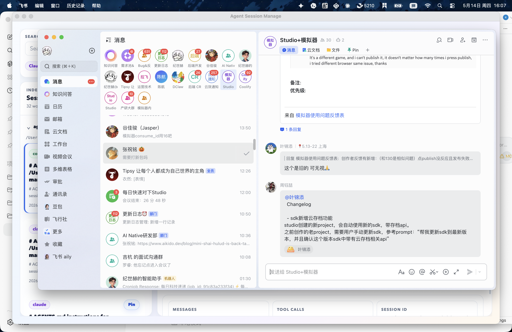

# Agent Session Manage

Agent Session Manage is a local desktop and CLI tool for browsing, searching, resuming, exporting, and converting Claude Code and Codex sessions from one unified index.

It is designed for people who use multiple agent CLIs across many worktrees and need a practical way to find old context, reopen a conversation, or move a session between tools.



## Features

- Scan local Claude Code and Codex session files automatically on startup.
- Watch local Claude/Codex session directories and refresh the index when files change.
- Store session metadata, messages, and tool calls in a local SQLite index.
- Search sessions by title, path, branch, source, session id, or message text.
- Group sessions by project/worktree path in the desktop UI.
- Collapse or expand each worktree group.
- Pin important sessions so they stay at the top of the list.
- Inspect session metadata, messages, and tool activity.
- Resume a session as Claude or Codex from the desktop app.
- Open resume commands in macOS Terminal or Ghostty.
- Export a session to Markdown.
- Convert sessions between Claude and Codex formats.
- Delete a session from the local index without deleting the original JSONL file.

## Desktop App

The desktop app is built with Electron, React, and Vite.

Main workflows:

- Search all indexed sessions. Leaving the search box empty shows all sessions.
- Let the app auto-scan at startup, or use `Search` to refresh the local index manually.
- Browse sessions grouped by worktree path.
- Use the `Pin` button on a session card to keep it near the top of the list.
- Switch between `Session Detail` and `Messages` tabs.
- Choose `System` or `Ghostty` in the `Terminal` switcher.
- Resume the selected session with Claude or Codex.
- Export or delete the selected indexed session.

### First Run

1. Install dependencies and start the desktop app:

```bash
npm install
npm run dev:desktop
```

2. On startup, the app scans local Claude and Codex session directories and imports changed files into:

```text
~/.agent-session-manage/index.sqlite
```

3. Leave the search box empty to show all indexed sessions, or type a title/path/branch/source/session id/message term to filter.

4. New or updated Claude/Codex JSONL files are detected by the desktop watcher and imported automatically.

Resume behavior:

- Codex sessions run:

```bash
codex resume --cd <project-path> <session-id>
```

- Claude sessions run:

```bash
cd <project-path> && claude --resume <session-id>
```

On macOS, the app opens Terminal and starts the resume command there.

If `Ghostty` is selected, the app launches:

```bash
open -na Ghostty.app --args -e zsh -lc '<resume-command>'
```

The selected terminal is saved in browser local storage and reused on the next launch.

## CLI

Build first:

```bash
npm install
npm run build
```

Then use:

```bash
node dist/cli.js <command>
```

### Scan

```bash
node dist/cli.js scan
```

Discovers Claude and Codex sessions and imports changed files into the local index.

### List

```bash
node dist/cli.js list --limit 20
```

### Search

```bash
node dist/cli.js search "billing_dev" --limit 20
```

### Show

```bash
node dist/cli.js show <session-id>
node dist/cli.js show <session-id> --json
```

### Resume Command

```bash
node dist/cli.js resume-command <session-id>
```

Prints the native CLI command needed to resume the selected session.

### Export Markdown

```bash
node dist/cli.js export-md <session-id> ./out/session.md
```

Creates a readable Markdown transcript.

### Convert

```bash
node dist/cli.js convert <session-id> --to claude --output ./out/claude-home
node dist/cli.js convert <session-id> --to codex --output ./out/codex-home
```

The input can be either an indexed session id or a direct `.jsonl` file path.

### Delete From Index

```bash
node dist/cli.js delete <session-id>
```

Deletes the indexed session record and related indexed messages/tags/artifacts/import fingerprint. It does not delete the original Claude or Codex session file.

### Archive

```bash
node dist/cli.js archive <session-id>
```

Marks a session as archived in the index. The desktop UI currently favors delete over archive, but the CLI command remains available.

## Development

```bash
npm install
npm run check
npm run build
npm run test
```

Run the desktop app:

```bash
npm run dev:desktop
```

Run only the renderer dev server:

```bash
npm run dev:renderer
```

## Project Structure

- `src/model/session.ts` — canonical session model.
- `src/discovery/` — local Claude and Codex session discovery.
- `src/parsers/` — native JSONL parsers.
- `src/store/` — SQLite schema and repository.
- `src/indexer/` — scan/import pipeline.
- `src/export/` — Markdown export.
- `src/convert/` — Claude/Codex materialization.
- `src/app/session-service.ts` — shared app service used by CLI and desktop.
- `src/cli.ts` — command-line interface.
- `src/desktop/` — Electron main process, preload, and IPC.
- `src/ui/` — React renderer.

## Storage

The local index is stored at:

```text
~/.agent-session-manage/index.sqlite
```

Session discovery reads from:

- Claude: `CLAUDE_CONFIG_DIR`, `CLAUDE_HOME`, or `~/.claude`
- Codex: `TRANSESSION_CODEX_HOME`, `CODEX_HOME`, or `~/.codex`

## Notes And Limits

- Conversion is practical, not lossless.
- Tool-specific runtime state is not fully recreated.
- Codex SQLite internals are not rebuilt.
- Claude sidechains and platform-specific internals are not fully reproduced.
- Deleting from the app removes only local index records, not source JSONL files.

## Scripts

```bash
npm run check
npm run build
npm run build:node
npm run build:renderer
npm run dev:desktop
npm run dev:renderer
npm run test
```
